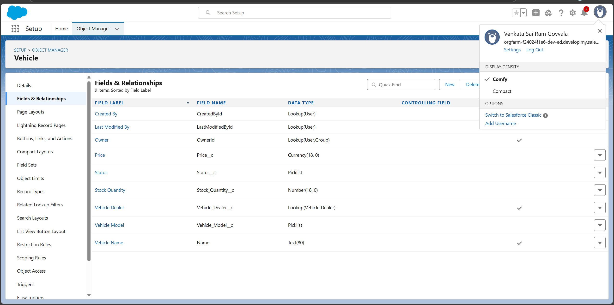
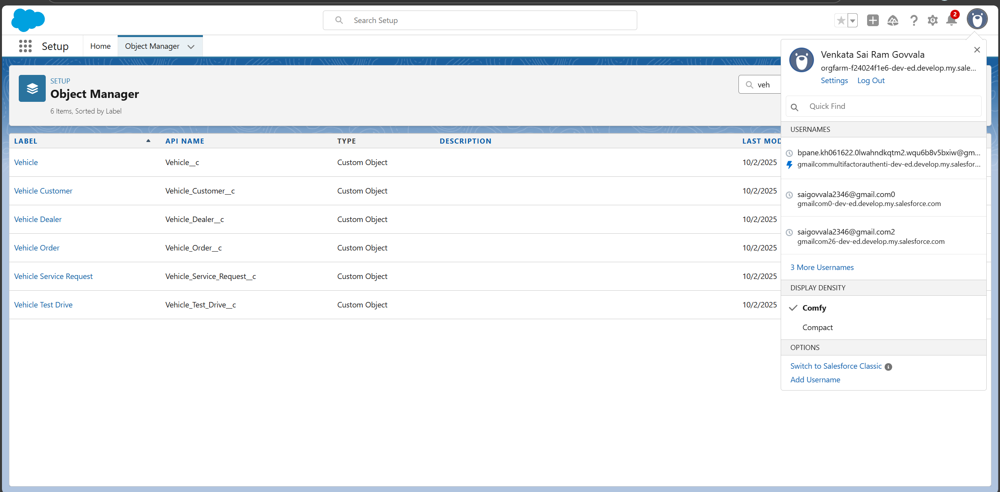
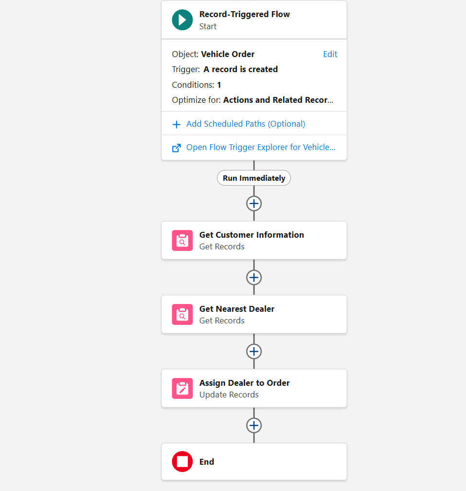
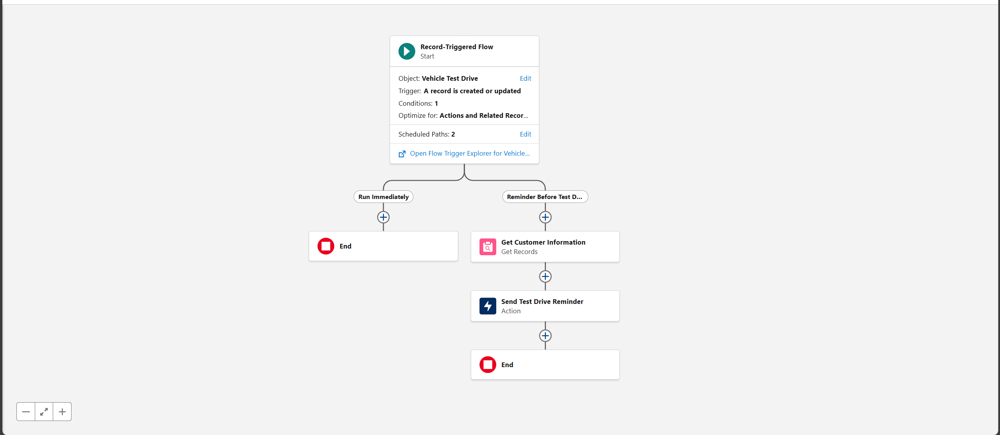
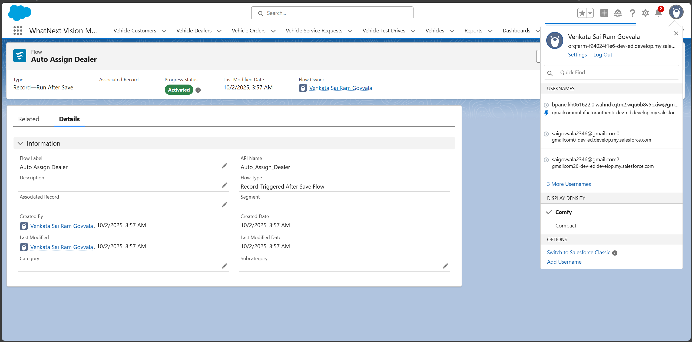

# WhatNext Vision Motors: Salesforce CRM Project

## Overview
WhatNext Vision Motors leverages Salesforce CRM to automate the customer vehicle order process, streamline dealer assignment, and ensure real-time stock validation. The solution integrates custom Apex code and automation tools to deliver a seamless, efficient workflow for both customers and internal teams.

## Features
- CRM Implementation for vehicle order management
- Automated dealer assignment and stock validation
- Custom Apex triggers and handler classes
- Batch jobs for processing pending orders


## Repository Structure
```
├── /docs                # Documentation & diagrams
│   ├── README.md        # High-level documentation
│   └── flows.md         # Flowcharts (text-based placeholder diagrams)
├── /apex-code           # Sample Apex triggers & batch classes
│   ├── VehicleOrderTriggerHandler.cls
│   ├── VehicleOrderTrigger.trigger
│   ├── VehicleOrderBatch.cls
│   └── VehicleOrderBatchScheduler.cls
├── /screenshots         # Salesforce screenshots
│   ├── Fields.png
│   ├── Objects.png
│   ├── VehicleOrderFlow.png
│   ├── VehicleTestDriveFlow.png
│   └── WhatsNextVision.png
└── README.md            # Root project documentation
```

## Screenshots
Below are key Salesforce setup and process screenshots for reference:

| Screenshot                | Description                       |
|---------------------------|-----------------------------------|
|  | Custom Fields Configuration         |
|  | Custom Objects Overview             |
|  | Vehicle Order Automation Flow         |
|  | Test Drive Process Flow              |
|  | Project Dashboard / Home              |


## Setup
1. Clone this repository to your local machine.
2. Open Salesforce Developer Org.
3. Deploy the contents of `/apex-code` to your org using Salesforce Setup or VS Code with Salesforce Extensions.
4. Review `/docs` for process details and flow diagrams.
5. Add screenshots to `/screenshots` as needed.

## Contributors
- [Your Name Here]
